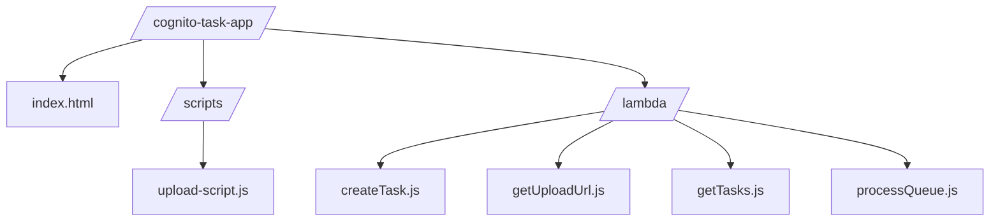

# 🚀 Cognito Task Manager - AWS Serverless Powerhouse ⚡


🔗 **Live Demo**: [https://d4jy0dgm09bv1.cloudfront.net](https://d4jy0dgm09bv1.cloudfront.net)

## 🌟 Why This Rocks

✅ **Zero servers** - 100% serverless architecture
✅ **Battle-tested** - Dual database redundancy
✅ **Secure by design** - End-to-end encryption
✅ **Cost efficient** - Pay only for what you use
✅ **Blazing fast** - Edge-optimized delivery

## 🏗️ Architecture Blueprint

```mermaid
graph LR
    U[User]-->|1: Login|C(Cognito)
    U-->|2: Visit App|EC2[EC2: Static Hosting]
    EC2-->|3: Serve|UI[index.html + JS]

    UI-->|4: Auth|C
    C-->|5: JWT|UI

    UI-->|6: File Upload|S3[S3 Bucket]
    UI-->|7: Send Metadata|G[API Gateway]
    G-->|8: Proxy|VPC[VPC (with private Lambda)]
    VPC-->|9: Logic|L[Lambda: createTask.js]

    L-->|10a: Write|R[(PostgreSQL RDS)]
    L-->|10b: Cache|D[(DynamoDB)]
    L-->|10c: Notify|Q[SQS Queue]

    Q-->|11: Trigger|M[Lambda: processQueue.js]
    M-->|12: Email|N[(Nodemailer SMTP)]

    R-->|fileKey|S3
    D-->|fileKey|S3
```

### 4. Project Structure Block

## 📂 Project Structure



### 5. Tech Stack Block

## ⚡ Tech Stack

| Layer        | Technology        | Benefit                    |
| ------------ | ----------------- | -------------------------- |
| **Frontend** | Vanilla JS + EC2  | Lightweight UI hosting     |
| **Auth**     | Cognito           | Enterprise-grade security  |
| **Compute**  | Lambda            | Auto-scaling powerhouse    |
| **Storage**  | S3 + RDS + Dynamo | Perfect data trio          |
| **Infra**    | VPC               | Secure Lambda and RDS comm |

## 🔄 Data Flow

1. **Auth**: User → Cognito → JWT
2. **App Load**: EC2 → index.html + JS
3. **File Upload**: Direct to S3
4. **Task Submit**: Metadata → API Gateway → VPC → Lambda → DBs
5. **Notification**: SQS → Lambda → Email via Nodemailer

### 8. License Block

No license bro
