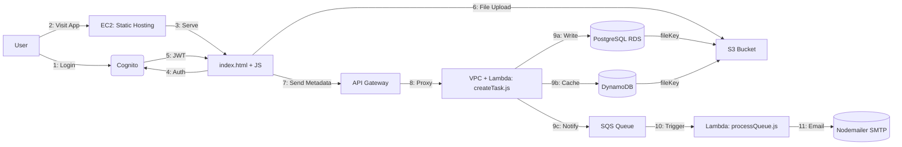
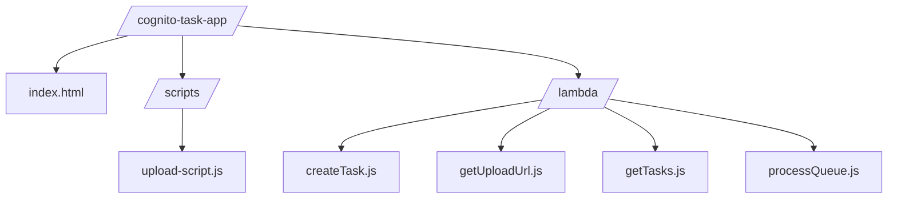
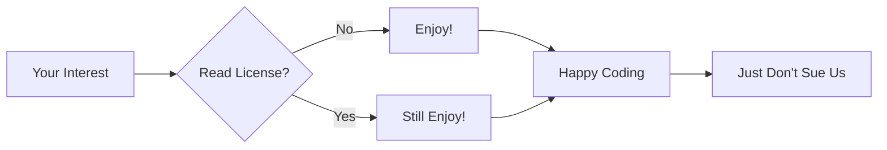

# 🚀 Cognito Task Manager - AWS Serverless Powerhouse ⚡

🔗 **Live Demo**: [https://d4jy0dgm09bv1.cloudfront.net](https://d4jy0dgm09bv1.cloudfront.net) Currently Down :(.

## 🌟 Why This Rocks

✅ **Zero servers** - 100% serverless architecture
✅ **Battle-tested** - Dual database redundancy with PostgreSQL & DynamoDB
✅ **Secure by design** - Cognito authentication and VPC-isolated Lambda
✅ **Cost efficient** - Serverless, scalable, and optimized usage
✅ **Blazing fast** - CloudFront edge-optimized static UI delivery
✅ **Seamless UX** - Direct-to-S3 file uploads, async task creation, instant feedback

## 🏗️ Architecture Blueprint

### 4. Project Structure Block

## 📂 Project Structure

### 5. Tech Stack Block

## ⚡ Tech Stack

| Layer        | Technology        | Benefit                               |
| ------------ | ----------------- | ------------------------------------- |
| **Frontend** | Vanilla JS + EC2  | Lightweight UI, hosted via EC2        |
| **Auth**     | Cognito           | Secure user login & JWT issuance      |
| **Compute**  | Lambda            | Stateless logic handling, async flows |
| **Storage**  | S3 + RDS + Dynamo | Reliable, fast, and durable storage   |
| **Infra**    | VPC               | Secure connectivity for Lambda/RDS    |
| **Queueing** | SQS               | Decoupled email and processing layer  |
| **Email**    | Nodemailer (SMTP) | Easy transactional notifications      |

## 🔄 Data Flow

1. **Auth**: User logs in via Cognito, receives JWT
2. **App Load**: EC2 hosts `index.html`, JS interacts via API
3. **File Upload**: Direct PUT to S3 using pre-signed URLs
4. **Task Submit**: Task metadata sent to Lambda via API Gateway (inside VPC)
5. **DB Write**: Lambda writes to PostgreSQL and DynamoDB
6. **Queue Trigger**: SQS triggers `processQueue.js` Lambda
7. **Notification**: Email sent to user via Nodemailer + Gmail SMTP

### 6. License Block

## 🚦 License - "The MIT License But With More Sass"

This project is licensed under the **"I'm Not a Lawyer But Here's Some Rules" License**:

**By using this code you agree to:**

**-Bring snacks to the next standup**

**-Not judge our questionable Lambda naming conventions**

**-Pretend the documentation was always this good**
