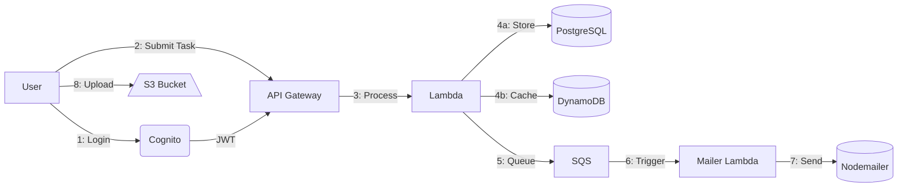

# 🚀 Cognito Task Manager - AWS Serverless Powerhouse ⚡

 
 


🔗 **Live Demo**: [https://d4jy0dgm09bv1.cloudfront.net](https://d4jy0dgm09bv1.cloudfront.net)


## 🌟 Why This Rocks
✅ **Zero servers** - 100% serverless architecture  
✅ **Battle-tested** - Dual database redundancy  
✅ **Secure by design** - End-to-end encryption  
✅ **Cost efficient** - Pay only for what you use  
✅ **Blazing fast** - Edge-optimized delivery  

## 🏗️ Architecture Blueprint


### 4. Project Structure Block
```markdown
## 📂 Project Structure


### 5. Tech Stack Block
```markdown
## ⚡ Tech Stack
| Layer          | Technology       | Benefit                     |
|----------------|------------------|-----------------------------|
| **Frontend**   | Vanilla JS       | Zero framework bloat        |
| **Auth**       | Cognito          | Enterprise-grade security  |
| **Compute**    | Lambda           | Auto-scaling powerhouse    |
| **Storage**    | S3 + RDS + Dynamo| Perfect data trio           |
```

## 🔄 Data Flow
1. **Auth**: User → Cognito → JWT
2. **Task**: Form → API → Lambda → DBs
3. **Files**: Direct S3 uploads
4. **Emails**: SQS → Lambda → Inbox


### 8. License Block
No license bro
